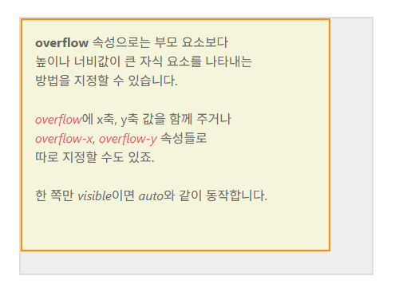
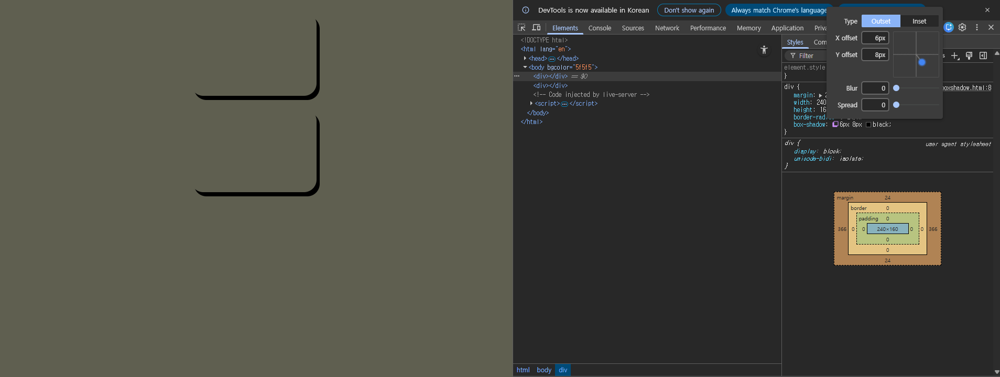
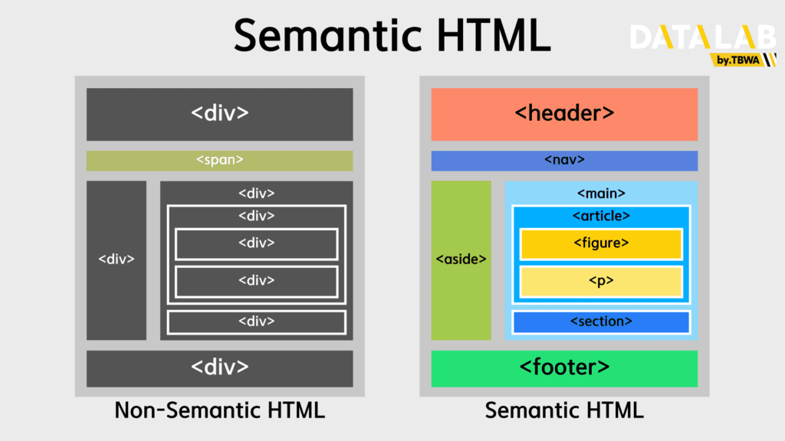

# 입실 체크 해주세요 !! 🎈

### box-sizing
https://showcases.yalco.kr/html-css/02-07/01.html

box-sizing 속성은 속성값으로
  1. content-box : padding(안쪽 여백)을 제외하고 텍스트 / 이미지 등의 내용이 들어갈 수 있는 영역만 계산함. 예를 들어 div의 width가 440px이라면 내용이 들어갈 수 있는 가로 길이가 440px이라는 의미.
  2. border-box : padding을 포함한 영역으로 좌측 여백 + 컨텐츠 영역 + 우측 여백을 합쳐서 div의 width가 결정됨. box-sizing을 border-box로 설정하고, width를 440px로 지정했다면 24(좌측여백) + 24(우측여백) + 392(컨텐츠영역) = 440으로 결정남. 그리고 추가적으로 외곽선(border)까지 지정했다면, 좌측외곽선 + 좌측여백 + 컨텐츠영역 + 우측여백 + 우측외곽선으로 결정남.

  지금 제가 위에서 div 요소라고만 이야기하고 있지만, div 태그의 원래 성격이 인위적으로 가로세로길이를 지정할 수 있기 때문이라는 점도 명심하셔야합니다.

### border-radius
1. 값을 하나만 주는 방법 : 네 군데 모서리에 모두 적용됨.
2. 값을 두 개로 주는 방법 : 첫 번째 속성값은 상단 왼쪽과 하단 오른쪽 / 두 번째 속성값은 상단 오른쪽 / 하단 왼쪽
3. 값을 네 개로 지정하는 경우 : 왼쪽 상단 모서리부터 시계방향으로 결정남.
https://showcases.yalco.kr/html-css/02-07/01.html 에서 확인하시기 바랍니다.

06_borderradius.html / css 생성

힌트 # 1 : 정사각형이어야 합니다.
힌트 # 2 : border 관련 속성을 지정해야 됩니다.
힌트 # 3 : 제일 편하게 하려면 곡률을 % 상대값으로 줘야 합니다. -> 50%

이상의 경우에서 border 속성을 주석 처리 했을 때
```html
<!DOCTYPE html>
<html lang="en">
<head>
  <meta charset="UTF-8">
  <meta name="viewport" content="width=device-width, initial-scale=1.0">
  <title>Document</title>
  <style>
    div {
      width: 200px;
      height: 200px;
      border: 5px solid black;
      box-sizing: border-box;
      border-radius: 50%;
      background-color: antiquewhite;
    }
  </style>
</head>
<body bgcolor="5f5f5f">
  <h1>06_borderradius.html</h1>
  <div></div>
</body>
</html>
```
이상의 경우에서 border 속성을 주석처리했을 때 조금씩 위치가 이동하는 것을 봤을 때, box-sizing의 default 값은 뭐라고 해석할 수 있을까요? -> content-box

### overflow
- 부모 요소보다 높이나 너비가 큰 자식 요소를 나타내는 방법을 지정하는 속성.
https://showcases.yalco.kr/html-css/02-07/02.html


- overflow의 기본 속성값은 default로 auto로 잡혀있습니다.
  - auto : 자식 요소가 부모의 요소보다 큰 경우 스크롤바를 자동 생성
  - visible : 부모 영역을 벗어난 자식 요소를 그대로 보여주도록 허용(부모 요소의 크기를 무시하고 자식 요소를 전체 다 보여줍니다).
    - visible 속성은 가로세로를 전부 지정해줘야 합니다. 한쪽만 지정할 경우 auto와 동일한 결과값을 얻게 됩니다.
  - hidden : 부모 영역을 벗어나는 부분은 아예 보이지 않도록 합니다.
  - scroll : auto와 동일하게 영역을 넘어가는 가로세로 지점에 스크롤바를 생성하는데, 차이점으로는 자식 영역이 부모의 영역을 넘어가지 않더라도 일단 스크롤바를 보여줍니다.
- 속성값 두개 입력할 수도 있는데 첫번째가 x축 / 두번째가 y축에 해당
- overflow-x : 가로 부분
- overflow-y : 세로 부분

## 박스 그림자
https://showcases.yalco.kr/html-css/02-07/03.html
형식 :
div {
  box-shadow: (inset 여부) offset-x(x축 두께) offset-y(y축 두께) (blur-radius)(퍼짐효과 크기) (spread-radius)(그림자크기) color
}

실수값이 두 개 일 때 : x축 두께 / y축 두께
실수값이 세 개 일 때 : x축 두께 / y축 두께 / 퍼짐효과크기
실수값이 네 개 일 때 : x축 두께 / y축 두께 / 퍼짐효과크기 / 그림자 크기 지정

spread-radius는 그림자 크기를 지정하기 때문에 양수값을 입력하게 되면 상자보다 더 큰 크기의 그림자가 생성됩니다. 반면에 음수값을 입력하게 될 경우에는 그림자 크기가 상자보다 더 작아집니다.
inset 효과 : 박스 안쪽에 그림자가 생깁니다.

너무 복잡하면 chrome에서 box-shadow generator를 검색하세요.
07_boxshadow.html / css 생성


개발자 도구 상에서 임의적으로 css 수정을 해볼 수 있습니다. style 파트에 box-shadow 부분을 확인하시면 아이콘 하나 떠있습니다.

ch07_color_image
# 색 / 페이지로 웹페이지 꾸미기
# 색 표현하기
## 색을 표현하는 방법
### keyword
- 특정 색상의 이름을 키워드로 입력하는 방법으로 red / green / yellow 등
- 대표 색상의 keyword는 css color mdn을 검색하시면 됩니다.
### rgb / rgb(a)
- 빛의 3원색에 해당하는 red / green / blue를 조합해 색상을 나타내는 방식으로 각 색의 수치를 숫자 혹은 퍼센트를 사용하여 표시합니다. 0 ~ 255까지 있습니다. 정수값 255는 100%를 의미합니다.
- rgb(a)의 a는 알파값으로 불투명도를 나타냅니다(opacity).

### HEX
16진수로 색상을 표기하는 방식으로 저희는 5f5f5f를 썼습니다.
저희는 Java에서 객체의 주소값 할 때 본 적이 있습니다.
0123456789 - 10개의 숫자
0123456789abcdef - 16진수
#ffffff - 지금 .md에서 표시되듯이 흰색입니다. = rgb(255, 255, 255)
rba(a)와 마찬가지로 맨 마지막에 0 ~ 99를 통해서 불투명도 지정이 가능합니다.

### HSL(A)
색상, 채도, 명도값 알파값을 조합하여 색을 나타냅니다.
채도 : 색이 얼마나 분명하게 나타나는지
명도 : 색의 밝은 정도를 의미함.
근데 얘는 색상의 라인이 무지개색처럼 빨주노초파남보 색 거친 다음에 다시 빨간색으로 되돌아가서 360도 회전하는 것처럼 여겨집니다.

01_csscolor.html
# 배경 꾸미기
## 이미지를 배경에 사용하기
https://showcases.yalco.kr/html-css/02-08/01.html
배경은 넣고자 하는 이미지 파일을 그대로 삽입하거나 해당 이미지에 CSS로 다양한 효과를 적용하는 것이 가능합니다.
### background-image
- 배경에 특정 이미지를 삽입하고 싶다면 background-image 속성을 이용할 수 있는데, 해당 이미지가 있는 절대/상대 주소값을 url값으로 지정합니다. url(주소값) 형태로 작성하기 때문에 함수/method처럼 보이기도 합니다.
### background-repeat
- 배경 크기가 삽입한 이미지보다 큰 경우 삽입한 이미지를 가로세로로 반복해서 나타나게 합니다. repeat이 default값입니다.
- 속성값 목록
  1. repeat :알아서 반복됨
  2. no-repeat : 이미지가 한 번만
  3. repeat-x : x축으로만 반복
  4. repeat-y : y축으로만 반복
  5. space : 잘 안쓰이는데 이미지를 각 모서리에 먼저 배치한 다음에 남는 공간을 알아서 계산해서 일정한 간격을 두고 배치합니다.
  6. round : 배경의 최대 너비와 높이에 맞춰서 그냥 적절하게 계산해서 맞춰줍니다. repeat은 기본 이미지 크기를 그대로 반영하기 때문에 잘리는 부분이 생기는 반면에 round는 이미지 사이즈를 좀 바꿉니다.
  7. 응용도 가능합니다. background-repeat: repeat space;와 같은 식으로 x축 / y축 두 개의 값을 줄 수도 있습니다. 이상의 코드는 x축은 repeat이고 y축은 space가 적용됐다고 볼 수 있습니다.
### background-position
  1. %값 : 이미지의 중심축이 되는 배경의 어느 시점에 위치해야할지를 결정할 수 있음. 50% / 50% 로 정했을 때 가로축 50% 지점, 세로축 50% 지점이기 때문에 center로 지정한 것과 동일한 효과를 가지게 됩니다.
  2. vw / vh / vmax / vmin도 가능합니다.
  3. 특정 위치를 조합하여 사용하는 것도 가능합니다.

### background-size
  1. contain : 이미지의 비례와 상관없이 자연스럽게 배경에 맞춰서 이미지를 나타냄.
    - 여백이 있을 수 있음.
  2. cover : 여백없이 꽉 채우는 형태(div에 따라서 이미지가 잘릴 수 있음)

## 배경에 그라데이션 넣기
CSS gradient
그라데이션이란 두 가지 이상의 색을 사용하여 두 색을 점점 변화시켜 가며 채색하는 방법으로, 디자인에 특별히 신경 쓰는 포트폴리오가 아닌 이상 자주 쓰이는 방식은 아니기 때문에 색 표현 방식 중에 이런 것도 있다 정도로 알아두시면 되겠습니다.

### linear-gradient 속성값
그라데이션 적용 원리는 background 속성에 linear-gradient() 속성값을 지정하고, 괄호 내에 argument로 색상을 집어넣습니다. 그런데 색상을 표현하는 방식이 네가지 였죠. 네가지 다 가능합니다.

### linear-gradient로 세가지 색 지정하기

# chapter9 position & layout
# 포지셔닝
HTML 문서는 하나의 디바이스로만 여는 것이 아니기 때문에 위치값이 상대적입니다. 그래서 상대적인 위치를 잡는 포지셔닝 개념이 중요합니다. 그 기초 지식이 inline / block 개념이었습니다.

## position 속성
https://showcases.yalco.kr/html-css/02-09/01.html

- 특정 HTML 요소들이 해당 페이지에서 어떻게 배치될지를 결정하는데 사용하는 속성.
- 부모 요소의 것이 자식 요소에 상속되지 않는다는 점. -> orange의 position의 속성값과, red의 position 속성값이 별개로 작동한다는 점에 유의하셔야 합니다.

- position의 속성값들
### static
- 원래 존재하던 페이지 요소의 흐름을 따라감. : 원래 html 태그들의 위치를 따라간다고 생각하는게 좋음.
- top / bottom / left / right / z-index의 위치 속성의 영향을 받지 않습니다.
### relative
- 원래 있던 위치를 기준으로 top / bottom / left / right / z-index의 위치 속성의 영향을 받도록 할 때 사용하는 속성값
- 해당 요소가 차지하는 공백의 위치는 그대로 유지됨.
### absolute
- 바로 위 _position 속성의 속성값이 static이 아닌_ 부모 요소를 기준으로 top / bottom / left / right / z-index의 위치 속성의 영향을 받도록 할 때 사용하는 속성값.
- 그래서 만약에 바로 위 부모의 position 속성이 static이라면 그 윗단계로 넘어갑니다.
- orange의 position이 static이고, red의 position을 absolute로 설정한다면, 그 위 단계인 outer div의 위치 값을 따르게 됩니다.
- absolute는 자리를 차지하지 않습니다. 그래서 그냥 position: absolute를 지정하면 회색 div가 8개에서 7개로 줄어든 것처럼 보입니다. 근데 사실 회색 위에 orange div이 얹어져있었다는 것을 알 수 있습니다.
### fixed
- 부모 요소가 아니라 viewport를 기준으로 위치합니다. 뷰포트이기 때문에 스크롤 영향을 받지 않습니다.
- 고정된 위치에서 움직이지 않는다는 특징 때문에 웹사이트에서 어떤 팝업창 띄워놓고 스크롤해도 해당 위치에 존재하게끔 하거나, nav바에서 주로 사용합니다.
### sticky
- 어떤 요소가 스크롤로 이동할 수 있는 공간을 top / bottom / left / right / z-index의 속성값을 이용하여 지정.
- 웹사이트 상단에 어느 지점을 지났을때 고정되는 애가 있습니다.
- 근데 얘는 또 부모 요소의 여백에 영향을 받습니다. 자식 요소의 위치를 고정하더라도 부모 요소의 위치를 벗어나는 식으로 사용된다면 그 이상 움직일 수 없습니다.
### z-index
https://showcases.yalco.kr/html-css/02-09/02.html

default는 auto인데 0과 같다


### 중간 위치 관련 코드
```html
<!DOCTYPE html>
<html lang="en">
<head>
  <meta charset="UTF-8">
  <meta name="viewport" content="width=device-width, initial-scale=1.0">
  <title>Document</title>
  <style>
    body {margin: 0;}
    div {
      width: 300px;
      height: 80px;
      line-height: 80px;
      text-align: center;
      position: fixed;
      /* top: calc(50vh - 40px);
      left: calc(50vw - 150px); */
      top: calc(50% - 40px);
      left: calc(50% - 150px);

      background-color: darkcyan;
    }
  </style>
</head>
<body bgcolor="5f5f5f">
  <div>
    해당 요소를 화면 가운데에 배치하겠습니다.
  </div>
</body>
</html>
```

# flex 레이아웃
- 모든 웹사이트는 큰 레이아웃 형태의 구조로 되어있고, 만드는 방식도 다양합니다. 예전에는 inline / block / inline-block을 통해서 하나하나 위치를 지정해주는 작업을 많이 했었는데, flex 레이아웃 적용 이후에는 CSS 코드 작성 메커니즘이 좀 바뀌었습니다.

https://showcases.yalco.kr/html-css/02-11/01.html

## 부모에 적용하는 flex
- flex 레이아웃의 경우 부모 요소에 적용하는 속성과 자식 요소에 적용하는 속성으로 구분됩니다.
- 이상의 사이트를 기준으로 설명합니다.
  - display: block;의 경우 default 값으로 볼 수 있습니다.
  - display: flex;를 적용했을 경우 보라색 div들이 수평 배치되는 것을 확인할 수 있습니다.
  - display: inline-flex;로 지정했을 경우, 회색 div 부분이 inline-block으로 바뀌면서 자식 요소들은 flex와 동일한 방식으로 배치합니다.
  - display값의 조정은 해당 부모 요소를 inline으로 만드는 것이 flex / inline-flex의 차이점이 됩니다.
  - 그래서 이하에서 설명하는 내용들은 display: flex / inline-flex를 기준으로 설명하게 됩니다.

### flex-direction
- 내부 자식 요소들을 어느 축을 기준으로 정렬할지 결정함. default 값은 row
- 그래서 display: flex / flex-direction: row일 경우 자식 요소들을 row 방향으로 배치
- 그렇다면 flex-direction: row-reverse의 경우 자식 요소의 순서를 반대의 row방향으로 배치합니다.
- column도 동일한 방식으로 작동합니다.
- flex-direction의 속성값(즉 축의 방향)에 따라 justify-content / align-items / align-content 등의 속성이 작동하는 방향이 결정됩니다.
- display:flex;를 적용하는 순간 순차적으로 다음 속성의 속성값들을 고려할 필요가 있습니다.

### justify-content
- 메인 축에서 내부 요소를 정렬하는 방식을 결정.
- display: flex를 적용했기 때문에 -> flex-direction: row로 정했으면 -> justify-content: flex-start로 잡았다고 가정했을 때, 그러면 자식 요소들이 row로 정렬되는데, 시작점부터니까 왼쪽부터 정렬될 것이다라고 추측할 수 있습니다.
- space-between : 내부 양쪽 요소의 처음과 시작 부분에 배치하고, 가운데에 빈 공간을 알아서 채워넣습니다.
- space-around : 내부요소의 양쪽에 일정한 크기의 빈공간을 두고 배치
- space-evenly : 모든 빈 공간의 크기를 일치시킴.

### align-items
- flex의 마이너 축(flex-direction이 row면 column을 의미함)에서 내부 요소를 정렬할 방식을 결정하는 속성.
- default 값으로 stretch가 적용되어있습니다. 즉 flex-direction: row이고, align-items가 stretch라면 마이너 축이 column 방향으로 stretch(즉 뻗어나감)된다는 것으로 해석할 수 있씁니다.
  
- 그러면 이상까지 왔을 때 flex의 default 형태가 왜 123 div들이 세로로 길어졌는지 이해할 수 있겠네요.
  
- align-items : flex-start로 지정하면 수직 축의 시작부분, 즉, y축 상단으로 내부 요소를 갖다 붙이게 됩니다.
- align-items : center 중양 정렬
- align-items : flex-end 하면 y축 하단부터 시작
- 그러면 stretch 제외 나머지가 48px*48px인 이유는 참조 사이트의 설정때문에 그렇습니다.

### flex-wrap
- 자식 요소가 부모의 요소의 영역을 넘어갈 정도로 많을 경우에 하는 배치 방법입니다.
- flex-wrap: wrap으로 하면 내부 요소가 부모 요소를 넘어가지 않도록 _자동으로_ 배치해줍니다. 주로 컨텐츠가 한 줄이 아니라 여러 줄일 때 적용합니다.

### align-content
- display: flex / flex-direction: row / justify-content: flex-start / align-items: flex_start / flex-wrap: wrap이라면 내부 요소에 공백이 다양한 방식으로 생겼습니다. 예를 들면 이상의 속성값인 경우에 오른쪽 부분에 공백이 생기겠네요.
- 이상의 속성값을 유지한 상태에서 align-content를 flex-start / center / flex-end로 바꿨을 경우에는 내부 요소 전체가 공백 _없이_ 위, 가운데, 아래쪽으로 붙는다는 점을 알 수 있습니다.
- 그러면 얘가 align-items랑 관련있겠네 싶겠지만 또 헷갈리게 justify-content처럼 space-between / ㅁround / evenly 처럼 간격 조절을 할 수 있는 방법이 따로 있습니다.

실제 실무까지 갔을 때 align-content까지 적용하는 사례가 그렇게 많지는 않습니다.

### gap
- 내부 요소들 사이에 들어가는 공백의 크기를 지정하는 속성, em 단위 사용 /  두개의 값을 지정해서 가로 공백 / 세로 공백을 별개로 지정할 수도 있음

## 자식에 적용하는 flex
https://showcases.yalco.kr/html-css/02-11/02.html

### flex-basis / flex-shrink
1. flex-basis : 메인 축의 길이를 지정함.
  - 중요한 것은 부모 요소가 display: flex;가 정해져있는 상태라면 자식 요소들의 너비 / 높이가 고정되는 경향이 있는데, 특정한 자식 요소의 너비 / 높이를 임의적으로 정할 수 있다는 점에서 가치가 있습니다. / default 값은 auto
2. flex-shrink : 전체 공간이 부족할 경우(즉 부모 요소의 크기가 고정되어있는 경우) 해당 내부 요소의 크기가 컨텐츠의 너비 또는 flex-basis로 지정한 값보다 알아서 작게 고정될 수 있도록 조절하는 속성. default 값은 1 // 값을 0으로 입력하면 부모 요소의 영역 바깥으로 빠져나갑니다.
  - flex-shrink가 1인 상태에서 자식 요소들이 부모 요소의 크기보다 커지려고 하면 마이너 축 방향으로 늘어납니다.

### flex-grow
- 내부 요소에 빈 공간이 있을 경우에 그 공간을 채울지의 여부를 결정하고, 채울 경우에는 자식 요소들끼리의 flex-grow의 값에 따라 비례적으로 부모 영역을 분할하게 됩니다.

### order 속성
https://showcases.yalco.kr/html-css/02-11/04.html
들어가서 건드려보면 html 태그 순서와 ux의 순서를 다르게 조작할 수 있는 CSS입니다.

# 요소를 감추는 방법
https://showcases.yalco.kr/html-css/02-10/02.html
## 3가지 방법
### # 1 opacity 적용 방법
- 요소의 불투명도를 조절하는 속성으로 0 ~ 1까지의 값을 가집니다. 근데 안보이는거지 사라진게 아니기 때문에 기능이 동작합니다.
### # 2 visibility
1. visible
  - default
2. hidden
  - 안보이고 기능도 전부 사라집니다.
  - 그런데 공백은 존재함
### # 3 display: none
  - 기존 요소가 차지하고 있던 자리까지 전부 다 날립니다.


